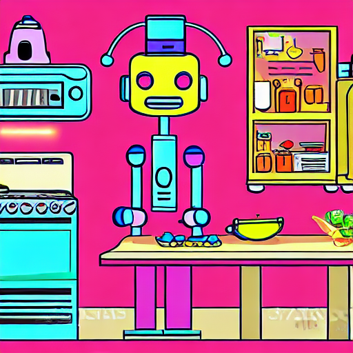
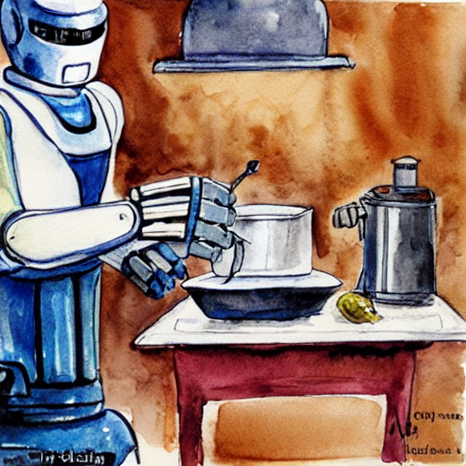
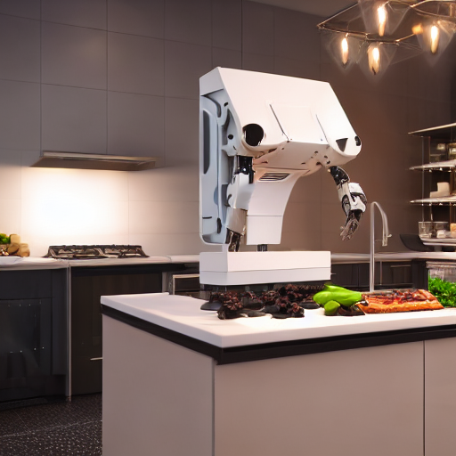
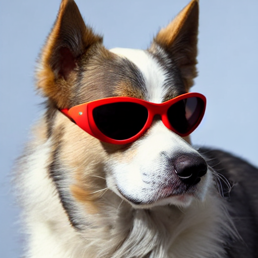
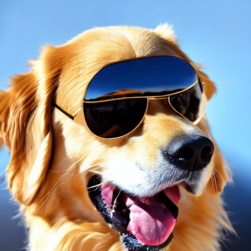

# Prompt Enhancer Experiment

**Goal:** measure how LLM prompt enhancement (Groq + `openai/gpt-oss-20b`) changes a Stable Diffusion image.

**Setup:** Stable Diffusion v1.5 on a Colab T4 GPU, 512x512, 30 steps, guidance scale 7.5, seed `3572992927`. The seed, steps and guidance were identical for every run, so **only the prompt changed**.

---

## 1. Plain prompt (baseline)

> Bangalore airport in the day

---

## 2. First enhanced prompt (too long and repetitive)

> Bangalore International Airport, midday, bright daylight, wide-angle shot from ground level, bustling crowds, modern architecture, reflective glass surfaces, crisp sky, vibrant city vibe, high resolution, cinematic lighting, vibrant colors, realistic style, 8k quality, sharp focus, atmospheric depth, subtle motion blur, dynamic composition, HDR, cinematic mood, realistic textures, detailed signage, bustling taxiway, serene blue sky, high clarity, cinematic atmosphere, cinematic lighting, hyper realistic, 4k, ultra detailed, cinematic composition, vibrant atmosphere, dynamic perspective, realistic lighting, high detail, cinematic, realistic, high quality, sharp focus, cinematic, vibrant, realistic, detailed, high resolution, 8k, 4k, cinematic, realistic, hyper-detailed, high-quality, cinematic, realistic, high detail.

**Problems found:**

- Over 100 words long.
- Heavy repetition: "cinematic" appears about 9 times and "realistic" about 8 times. "8k", "4k" and "sharp focus" repeat too.
- Stable Diffusion's text encoder (CLIP) reads only the first 77 tokens, so most of this prompt was cut off and ignored. The repeated filler also used up space that useful details needed.
- The model ignored the "maximum 50 words" instruction in my system prompt.

---

## 3. Cleaned enhanced prompt (after the fix)

> Bangalore airport terminal, bright daylight, bustling crowds, wide-angle view, reflective glass surfaces, vibrant signage, serene atmosphere, subtle shadows, panoramic perspective, modern architecture, subtle lens flare

About 25 words in 11 phrases, with no repeated words, well inside the 77-token limit.

---

## What I changed to fix it

1. **Stricter system prompt:** 8 to 12 comma-separated phrases, 40 words maximum, no repeated words, at most one quality tag.
2. **`clean_prompt()` in the backend (`llm.py`):** removes duplicate phrases, skips phrases that add no new words, and stops at 45 words. This guarantees a usable prompt even when the LLM ignores instructions.
3. **Lower temperature (0.5):** less rambling output.

---

## Observations

- The enhancer adds useful scene details that the plain prompt lacked (glass surfaces, wide-angle view, signage, lens flare).
- LLM output can contradict itself: "bustling crowds" and "serene atmosphere" pull in opposite directions.
- Prompt length matters: keep prompts well under 77 tokens, because anything beyond that has no effect.
- Relying on instructions alone is not enough, so I added a code-level cleanup step as a safety net.
- My comparison of the two images:
  - What changed: the enhanced prompt changed the subject. The plain prompt produced a plane on the runway with a terminal behind it. The enhanced prompt produced a large terminal building with a crowd in the foreground and no plane.
  - What is better: more of the added details appeared (crowds, glass facade, wide-angle view, modern architecture), and there was no garbled lettering on an aircraft.
  - What is worse: the enhancer changed "airport" to "airport terminal", so the aircraft disappeared. It did not just add detail, it shifted what the image is about.
  - Conclusion: an LLM enhancer can change the meaning of a prompt, not only improve it. The word "terminal" steered the whole scene. A good enhancer should keep the original keywords intact, which is worth testing next.

---

## Limitations

- One prompt and one seed were tested, so this is a small sample, not a statistical result.
- Image quality was judged visually, with no automated metric (such as CLIP similarity).
- Stable Diffusion v1.5 often produces garbled text on signs and aircraft.
---

## Style presets

Each preset adds style words to the end of the prompt and sometimes extra words to the negative prompt. Nothing else changes.

**Setup:** prompt `a robot cooking in a kitchen`, seed `12345`, 30 steps, guidance 7.5. Only the style was changed between runs.

| Style | Words added to the prompt | Image |
|---|---|---|
| None | (nothing) |  |
| Anime | anime style, vibrant colors, clean line art |  |
| Watercolor | watercolor painting, soft washes, paper texture |  |
| 3D Render | 3d render, octane render, soft studio lighting |  |

**Observation:** each preset produced a visibly different texture that matched the chosen style, and the style was clear in every image.

**Takeaway:** a "style" is just extra prompt text that steers the model toward a look. There is no separate style model.
---

## Style presets

Each preset adds style words to the end of the prompt and sometimes extra words to the negative prompt. Nothing else changes.

**Setup:** prompt `a robot cooking in a kitchen`, seed `12345`, 30 steps, guidance 7.5. Only the style was changed between runs.

| Style | Words added to the prompt | Image |
|---|---|---|
| None | (nothing) |  |
| Anime | anime style, vibrant colors, clean line art |  |
| Watercolor | watercolor painting, soft washes, paper texture |  |
| 3D Render | 3d render, octane render, soft studio lighting |  |

**Observation:** each preset produced a visibly different texture that matched the chosen style, and the style was clear in every image.

**Takeaway:** a "style" is just extra prompt text that steers the model toward a look. There is no separate style model.
---

## Vague prompt test: "dog with sunglasses"

**Setup:** seed 12345, 30 steps, guidance 7.5, generated side by side in the Compare tab. Only the prompt differs.

| Plain | Enhanced |
|---|---|
|  |  |

**Plain prompt:** `dog with sunglasses`

**Enhanced prompt:** golden retriever wearing black aviator sunglasses, sunny park, bright midday light, playful grin, eye-level shot, vibrant atmosphere, candid portrait, natural color

**Observation:**
- What changed: The clarity of the image and due to enhancement prompt showed that it was bright so it mainatained a dog with bright features like- golden retreiver
- Did the enhanced version keep the subject (dog and sunglasses)? Yes 
- Is it better? yes the clarity improved and breed was specific